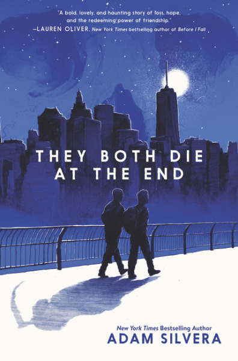
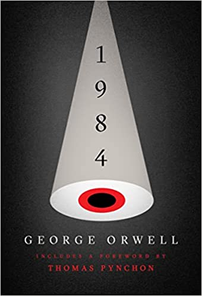

## Review of Reviews

 I've come across someone with a plethora of book reviews, most of which I think are uninspired and close-minded. Here I will criticize the worst, yet most interesting ones. 

### Ender's Game by Orson Scott Card

Here is the poster's original review: 

 "4.5/5 : Omg top 10 sci-fis I've ever read fr. Definetly lived up to the hype and it's so crazy to me that bro was only 6"

First, let's address the sci-fi in the room. Sci-fi is stupid. How are you science-based if what you are is fiction in reality? Sci-fi is an excuse for nerds to write fantasy that takes place in space. So our dear critic calling this novel "sci-fi" already sets the tone for this sorry excuse for a review. Then, the reviewer goes on to explain how it lived up to its hype. This is the only credible part of the review. It is true, Ender's game is rated 4.31 on GoodReads (the most credible website that has ever existed), and is apparently widely loved. The reviewer's only valid statement about this story is an objective fact about the popularity of the novel. And their last comment, that "bro was only 6,"....I just don't care. I give the review a 1/5 stars.

### They Both Die at the End by Adam Silvera 
 

Here's the original review:

"4/5: Great commentary about life and death and love and loss. So sad but in an aching way great book" 

Wow, it's a book about life and death and love and loss! And left the reviewer achingly sad! It reads like it was written on a car ride to some Met Gala-like event, and the poster only had 30 seconds to scribble something down. The only redeemable aspect: my mom liked this book a lot. So the rating, at least, is valid. I rate this review a 1.5/5 stars. 

### 1984 by George Orwell 
 

Original review: 

"4.5/5: The misogyny is strong in this one but damn that message is strong. That philosophy at the end regarding the existence of reality only in mind is so interesting and the idea of surveillance in the context of AI wow"

This review isn't as bad as the others. The criticism of misogyny is more specific than anything else in the other reviews. This one I disagree with in an ideological sense. The reviewer seems to be concerned about AI surveillance, something I think is dramatized and okay in reality. Ai and the companies behind them are only after what is best for its customers, and only look to compete amongst other AI companies. This is the promise of capitalism. Data is tracked to improve user experience, and further the software. Two things, that, in my opinion, aren't bad at all! This poster obviously wants no internet, if privacy and security is what they're after. Let the AI have its fun. I rate this review a 3/5 - while still a little frugal in detail, it at least talks about the book's ideas in an interesting way that recontextualizes the story. 

## Links 

Here are the links to the books on Amazon (Amazon is my favorite website in the world) if you wanna read them and also experience this reviewer's awful takes. 

#### [The Ender's Game](https://www.amazon.com/Enders-Game-Ender-Quintet-1/dp/1250773024/ref=sr_1_1?dib=eyJ2IjoiMSJ9.y5lTyplGrvvgp_eLA4ZlvoPApYD1Uu9WfVgg_r8xqAnwV3G2sPG7b_OS62prRebvPCW9jUZ-iOkwSCypti5RkH2AfmWj0oafWEsae7D_Clsp-_6a6pni3_nbhaE7nc9VCkbMvVMXtYSM0WmARblnUY-1IHIpQEyo0TCqx9gc5KQoDpdpzaifgIhyr0ZwYKAryPoQnseg0krXFhJ31sFfuryUZEd2FzEdl2AlZJ_UvVw.cD0kX5d62oH_bVQII0uUl8jqF91zwlu9xUW-YOqsmYo&dib_tag=se&keywords=the+enders+game&qid=1790559333&sr=8-1)

#### [They Both Die at the End](https://www.amazon.com/They-Both-Die-at-End/dp/0062457802/ref=tmm_pap_swatch_0)

#### [1984](https://www.amazon.com/1984-George-Orwell/dp/0452284236/ref=sr_1_6?crid=2447GCAH9MYSH&dib=eyJ2IjoiMSJ9.gGFViPrSzpo-ZUw2gyAUTGWR-zVrsv1e8ANanQWQ4Eeq-vnr0hgotH73yKl_3NzBntoGp4MBvAVYRxejINJACooTwJeGkrFhnMHV9KHAMN5c_7283K-_dXhkQeP5afo1opk1_Xp-6HFbUkrgk4vi2rMi5Ck9L7CfjVuwJZhyudpkxWFeZySK-uZe1IOejl_HfhLRIpx7xzZEZS8tfriK6wbWZDOj7goLagbi82gVFzw.5UAHN6CQRkrsfAaMElRb8ni5IJ1VxC7B-9yOndMyLJQ&dib_tag=se&keywords=1984+george+orwell&qid=1790559544&s=books&sprefix=1984+%2Cstripbooks%2C187&sr=1-6)
