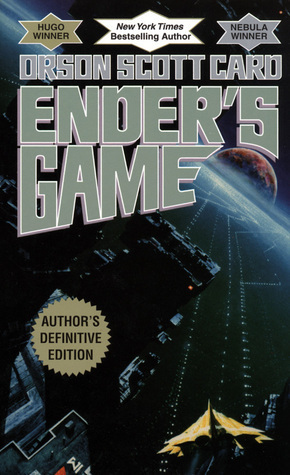

## Review of Reviews

 I've come across someone with a plethora of book reviews, most of which I think are uninspired and close-minded. Here I will criticize the worst, yet most interesting ones. 

### Ender's Game by Orson Scott Card

Here is the poster's original review: 

 "4.5/5 : Omg top 10 sci-fis I've ever read fr. Definetly lived up to the hype and it's so crazy to me that bro was only 6."

First, let's address the sci-fi in the room. Sci-fi is stupid. How are you science-based if what you are is fiction in reality? Sci-fi is an excuse for nerds to write fantasy that takes place in space. So our dear critic calling this novel "sci-fi" already sets the tone for this sorry excuse for a review. Then, the reviewer goes on to explain how it lived up to its hype. This is the only credible part of the review. It is true, Ender's game is rated 4.31 on GoodReads (the most credible website that has ever existed), and is apparently widely loved. The reviewer's only valid statement about this story is an objective fact about the popularity of the novel. And their last comment, that "bro was only 6,"....I just don't care. I give the review a 1/5.

#### They Both Die at the End by Adam Silvera 
im
Here's the original review:
"4/5: Great commentary about life and death and love and loss. So sad but in an aching way great book." 

Wow, it's a book about life and death and love and loss! And left the reviewer achingly sad! It reads like it was written on a car ride to some Met Gala-like event, and the poster only had 30 seconds to scribble something down. 
